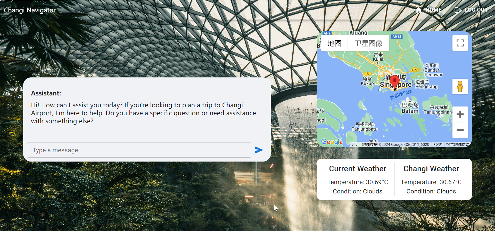

# Changi Navigator: Your Personalised Airport Trip Planner.

## Demo
[Google drive](https://drive.google.com/drive/folders/1ZZNTTo9huUWpporWO9m5X-TUug5KAJ3Y?usp=sharing)

## Getting Started

Start the app by running the commands below:

```bash
npm install
npm run dev
```

Go to [http://localhost:3000](http://localhost:3000) to view the webpage.


## Team members
Chen Jingyan,
Wong Shang Yi,
Zhao Yufan 


## Introduction
### Problem Statement:
Travelers may be uncertain about their transportation options and the time required to reach Changi Airport from their current location.

### Solution Architecture:
1) Login Page:

Authenticate user identity through MySql DB.

2) Welcome Page:

Handle user authorize access rights and some attractive features to appeal user. API engaged: Google Map, Unsplash, Google Calendar.

3) App Page:

Main application for chat, integrated with weather condition and event creation to improve user experience. API engaged: Google Map, Unsplash, Google Calendar, OpenAI, openweathermap.

### Legal/Other Aspects: 
We designed this webpage to be a proprietary product where we hope to collaborate with Changi Airport to offer it as a chatbot solutions and potentially expand our collaboration with other international airports.

### Competition analysis
Currently, the chatbot deployed on changiairport.com is not able to understand human questions effectively where it can \
only understand simple instructions. Therefore, we aim to enhance the user experience by:
1) Intelligent Chatbot: Using Large Language Model so that complex user requests can be understood easily.
2) New features: 
a) Offering travellers a flexible trip planner which assists users in planning. 
b) Setting up a reminder for their trip seamlessly in Google Calendar.
c) Having a visual representation of their current location and weather data for better trip planning.
d) Recommending tourist attractions in Singapore.
 
## UI Implementation
Material UI for UI library
Employee Unsplash API to enhance visual presentation and provide possible dynamic background based on location

## Back-end Implementation
1) Google Maps API:
Provides real-time geolocation services to pinpoint the user’s current location and provide recommanded tourist attractions.
Allows users to interactively move a map marker to obtain the geographical details of different locations, which is useful for fine-tuning travel plans and understanding various access points around Changi Airport.
2) OpenWeatherMap API:
Delivers real-time weather updates for the user's current location or any specified area.
Helps in planning travel by informing users about potential weather conditions they might face on their journey.
3) Google Calendar API:
Allows users to create and manage events directly from the application.
Users can set reminders for their flights or any other travel-related activities, which helps in managing their schedules efficiently.
4) Unsplash API:
Dynamically provides high-quality background images based on the user's current location.
Enhances the visual appeal of the application, making the user interface more engaging and personalized.
5) OpenAI API:
Integrates advanced AI-driven chatbot capabilities using OpenAI's language models.
Offers users intelligent and context-aware responses, improving interaction quality and providing effective support for complex queries about travel planning and facilities at Changi Airport.
